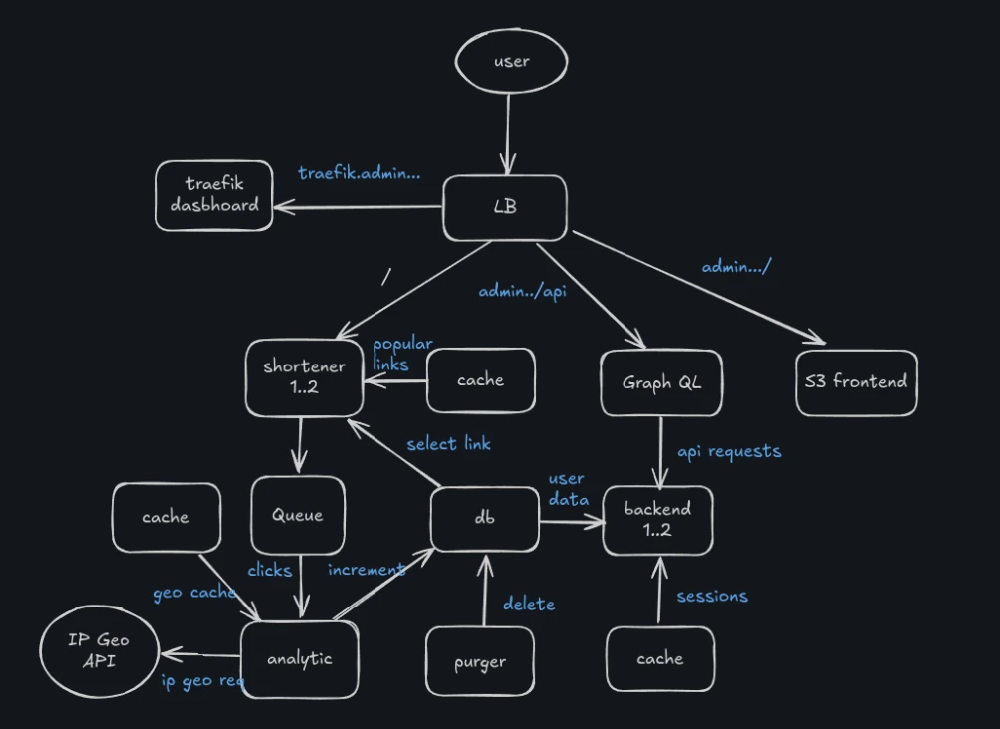

Silly event-driven url-shortener. The components are loosely coupled and outstand a service downtime.

#### tech stack

      

#### diagram

#### how to run?
1. Run `env/dev/init-tls.sh` and trust the CA file.
2. Create a copy of `env/init.conf.template` into `env/init.conf` and fill-out the fields. For the IP geolocation you must sign-in into their website (https://ipinfo.io/) - this project will use the lite version of ipinfo which is free.
3. Depending on what root domain you set in the `init.conf`, you must have it in `/etc/host`, if you're sticking to the default domain, put the lines of `domains.txt` into your `/etc/host`.
4. Run `env/dev/up.sh` to start the project.
